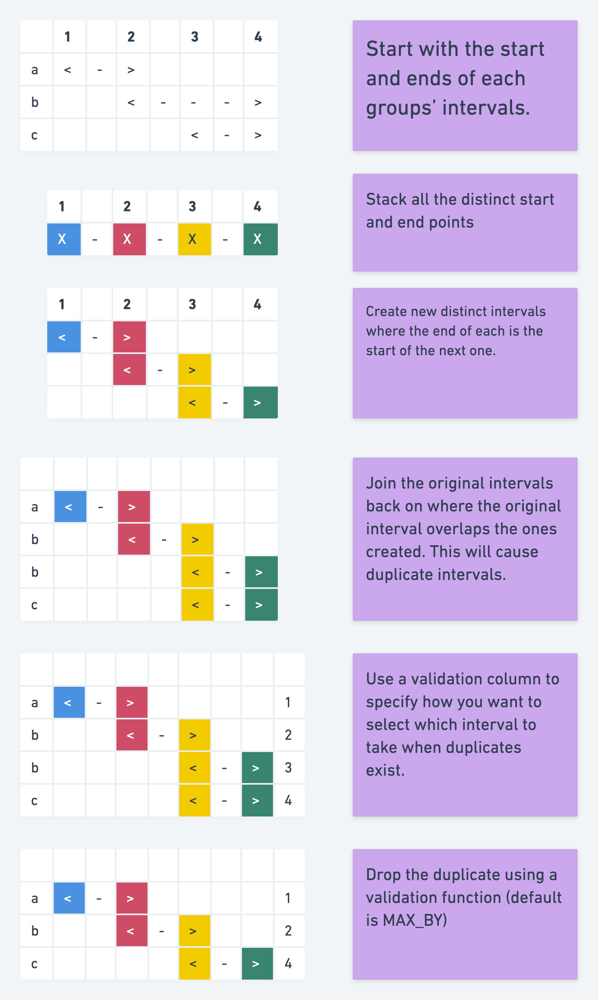



#sequentialize_table
##Overview
This macro takes an interval level dataset input where one row represents a period (`interval_start` & `interval_end`) that a certain set of values (`value_columns`) were attributable to a given group (`group_columns`). It will sequentialise the intervals within the dataset so that there are no overlapping intervals within each group. 
##Methodology
Let's consider the following dataset:

| group_id | interval_start | interval_end | value_a | value_b | updated_at          |
|----------|----------------|--------------|---------|---------|---------------------|
| 1        | 1              | 2            | 1       | 1       | 2020-01-01 00:00:00 |
| 1        | 2              | 4            | 1       | 1       | 2021-01-01 00:00:00 |
| 1        | 3              | 4            | 1       | 2       | 2022-01-01 00:00:00 |
| 2        | 1              | 3            | 1       | 1       | 2020-01-01 00:00:00 |
| 2        | 2              | 4            | 2       | 2       | 2021-01-01 00:00:00 |
| 3        | 1              | 3            | 1       | 1       | 2020-01-01 00:00:00 |
| 3        | 2              | 3            | 2       | 2       | 2021-01-01 00:00:00 |
| 4        | 1              | 4            | 1       | 1       | 2020-01-01 00:00:00 |
| 4        | 1              | 4            | 2       | 2       | 2021-01-01 00:00:00 |
| 4        | 2              | 3            | 3       | 3       | 2022-01-01 00:00:00 |
| 4        | 3              | 5            | 3       | 3       | 2022-01-01 00:00:00 |
| 5        | 1              | 2            | 1       | 1       | 2020-01-01 00:00:00 |
| 5        | 3              | 4            | 2       | 2       | 2021-01-01 00:00:00 |
| 5        | 5              | 6            | 3       | 3       | 2022-01-01 00:00:00 |
| 5        | 8              | 9            | 3       | 3       | 2022-01-01 00:00:00 |
| 6        | 2              | 3            | 1       | 1       | 2020-01-01 00:00:00 |
| 6        | 1              | 4            | 2       | 2       | 2021-01-01 00:00:00 |
| 7        | 1              | 4            | 1       | 1       | 2020-01-01 00:00:00 |
| 7        | 1              | 4            | 2       | 2       | 2021-01-01 00:00:00 |
| 7        | 2              | 3            | 3       | 3       | 2022-01-01 00:00:00 |
| 7        | 3              | NULL         | 4       | 4       | 2022-01-01 00:00:00 |
| 7        | 3              | NULL         | 5       | 5       | 2023-01-01 00:00:00 |

All the groups contain at least one problematic overlapping interval except for group 5 which contains gaps in the intervals.

####Group 1

